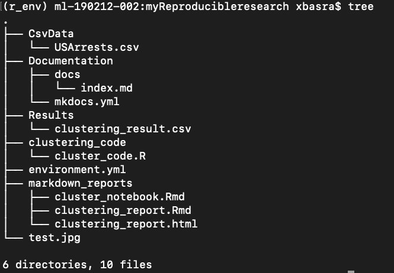

# Introduction to Git

Git is a widely used system (both in academia and industry) for version controlling files and collaborating on code. It is used to track changes in (text) files, thereby establishing a history of all edits made to each file, together with short messages about each change and information about who made it. Git is mainly run from the command line, but there are several tools that have implemented a graphical user interface to run git commands.

Using version control for tracking your files, and edits to those, is an essential step in making your computational research reproducible. A typical git workflow consists of:

- making distinct and related edits to one or several files
- committing those changes (i.e. telling git to add those edits to the history, together with a message about what those changes involve)
- and pushing the commit to a remote repository (i.e. syncing your local project directory with one in the cloud)


There are many benefits of using git in your research project:

- You are automatically forced into a more organized way of working, which is usually a first step towards reproducibility.
- If you have made some changes to a file and realize that those were probably not a good idea after all, it is simple to view exactly what the changes were and revert them.
- If there is more than one person involved in the project, git makes it easy to collaborate by tracking all edits made by each person. It will also handle any potential conflicting edits.
- Using a cloud-based repository hosting service (the one you push your commits to), like e.g. Github or Bitbucket, adds additional features, such as being able to discuss the project, comment on edits, or report issues.
- At some point your project will be published. Github or Bitbucket (or similar) are excellent places to publicly distribute your code. Other researchers can then use git to access the code needed for reproducing your results, in exactly the state it was when used for the publication.
- If needed, you can host private repositories on Github and Bitbucket as well. This may be convenient during an ongoing research project, before it is publicly published.

The best way to get an idea about git is simply to start using it. The tutorial below will guide you through the essential steps, with a focus on what is needed for making a project reproducible. There are many additional features of both git and the web-based repository hosting services (like Github and Bitbucket) that are not included here. If you are interested in learning more, the web is filled with information (see some examples below)!


# Git commands
* git init: Create an empty Git repository or reinitialize an existing one. Can be used to convert an unversioned project o a git repository or initialize a new empty repository. Until you run this command inside a repository or directory, it’s just a regular folder. Only after you input this does it accept further Git commands.
* git config: Get and set repository or global options. it is used for configuration of git for the first time.
* git status:  Show the working tree status. See which files are inside it, which changes still need to be committed, and which branch of the repository you’re currently working on.
* git add: Add file contents to the index.
* git commit: Git’s most important command. After you make any sort of change, you input this in order to take a “snapshot” of the repository. Usually it goes git commit -m “Message here.” The -m indicates that the following section of the command should be read as a message.

* git branch: Working with multiple collaborators and want to make changes on your own? This command will let you build a new branch, or timeline of commits, of changes and file additions that are completely your own. Your title goes after the command. If you wanted a new branch called “cats,” you’d type git branch cats.

* git checkout: Literally allows you to “check out” a repository that you are not currently inside. This is a navigational command that lets you move to the repository you want to check. You can use this command as git checkout master to look at the master branch, or git checkout cats to look at another branch.

* git merge: When you’re done working on a branch, you can merge your changes back to the master branch, which is visible to all collaborators. git merge cats would take all the changes you made to the “cats” branch and add them to the master.

* git push: If you’re working on your local computer, and want your commits to be visible online on GitHub as well, you “push” the changes up to GitHub with this command.

* git pull: If you’re working on your local computer and want the most up-to-date version of your repository to work with, you “pull” the changes down from GitHub with this command.

# Get started with Git

* Install Git
Chances are that you already have git installed on your computer. You can check by running e.g. ```git --version```. If you don't have git, install it following the instructions [here](https://git-scm.com/book/en/v2/Getting-Started-Installing-Git)


* Configure Git:
Now it’s time to go over to the command line. On Windows, that means starting the Git Bash app you just installed, and on OS X, it’s regular old Terminal. It’s time to introduce yourself to Git. Type in the following code:

        git config --global user.name "Your Name Here"

Of course, you’ll need to replace “Your Name Here” with your own name in quotations. It can be your legal name, your online handle, anything. Git doesn’t care, it just needs to know to whom to credit commits and future projects.

Next, tell it your email and make sure it’s the same email you used when you signed up for a GitHub.com account just a moment ago. Do it like this:

        git config --global user.email "your_email@youremail.com"


That’s all you need to do to get started using Git on your computer. However, since you did set up a GitHub.com account, it’s likely you don’t just want to manage your project locally, but also online. If you want you can also set up Git so it doesn’t ask you to log in to your GitHub.com account every time you want to talk to it. For the purposes of this tutorial, it isn’t a big deal since we’ll only be talking to it once. The full tutorial to do this, however, is located on [GitHub](https://help.github.com/en/github/getting-started-with-github/set-up-git).


* Creating Your Online Repository
Now that you’re all set up, it’s time to create a place for your project to live. Both Git and GitHub refer to this as a repository, or “repo” for short, a digital directory or storage space where you can access your project, its files, and all the versions of its files that Git saves.

Go back to GitHub.com and click the tiny book icon next to your username. Or, go to the new repository page if all the icons look the same. Give your repository a short, memorable name. Go ahead and make it public or private.

Skip the  initiate a README.md file option. Don’t worry about clicking the checkbox next to “Initialize this repository with a README.” A Readme file is usually a text file that explains a bit about the project. But you can make your own Readme file locally for practice later.

Click the green “Create Repository” button and you’re set. You now have an online space for your project to live in.

* creat your local repository
    - navigate to the directory where you want to locate your project.
    - on terminal use mkdir to create a directory name it for example myR_project.
    - cd to myR_project
    - type ```git init```


* Your computer now realizes this directory is Git-ready, and you can start inputting Git commands. Now you’ve got both an online and a local repo for your project to live inside.

* Now let us check the current status for our project, run ```git status```. It will state that there are untracked files and suggests for you to use git add to include in what will be committed.

* try to add one of the files. For instance run ```git add clustering_code``` then run again `git status`.

* You can also add multiple files in one command. For example, run `git add Documentation Results/`

* You might as well add all files in one go! Use `git add` on the remaining files

* We are now ready to commit! Run:

        git commit -m "adding the first set of files"

* modify any file with harmless changes, then run `git status`. What is the current status? As you can see git already catch the modification you did.
* Run `git diff file_name` use the name of the file you did a modification on instead of file_name. . A `-` means a deleted line, a `+` means an added line. There are also shown a few lines before and after the changes, to put them in context. Do tow another harmless modification in two different files. Run `git status`. Now run `git diff`. If we don't specify a file, it will show all changes made in any file,  compared to the previous commit. Do you see your changes?.

* Now as before git add the two files in one command and then git commit each of them in a separate command. This is a best practics as we want to optimally each commit to be a specified set of changes?

* To see a history of our changes so far, run:

        git log

If it is the first time you use git on your computer, you may want to configure it so that it is aware of your username. This username should match the username you have registered on Bitbucket. This will make it easier when you want to sync local changes with your remote Bitbucket repository.

git config --global user.name "Mona Lisa"

# Git with R



