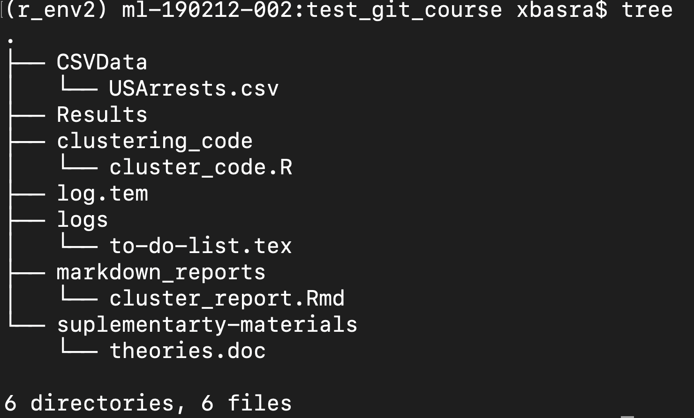

# Introduction to Git

Git is a widely used system (both in academia and industry) for version controlling files and collaborating on code. It is used to track changes in (text) files, thereby establishing a history of all edits made to each file, together with short messages about each change and information about who made it. Git is mainly run from the command line, but there are several tools that have implemented a graphical user interface to run git commands.

Using version control for tracking your files, and edits to those, is an essential step in making your computational research reproducible. A typical git workflow consists of:

- making distinct and related edits to one or several files
- committing those changes (i.e. telling git to add those edits to the history, together with a message about what those changes involve)
- and pushing the commit to a remote repository (i.e. syncing your local project directory with one in the cloud)


There are many benefits of using git in your research project:

- You are automatically forced into a more organized way of working, which is usually a first step towards reproducibility.
- If you have made some changes to a file and realize that those were probably not a good idea after all, it is simple to view exactly what the changes were and revert them.
- If there is more than one person involved in the project, git makes it easy to collaborate by tracking all edits made by each person. It will also handle any potential conflicting edits.
- Using a cloud-based repository hosting service (the one you push your commits to), like e.g. Github or Bitbucket, adds additional features, such as being able to discuss the project, comment on edits, or report issues.
- At some point your project will be published. Github or Bitbucket (or similar) are excellent places to publicly distribute your code. Other researchers can then use git to access the code needed for reproducing your results, in exactly the state it was when used for the publication.
- If needed, you can host private repositories on Github and Bitbucket as well. This may be convenient during an ongoing research project, before it is publicly published.

The best way to get an idea about git is simply to start using it. The tutorial below will guide you through the essential steps, with a focus on what is needed for making a project reproducible. There are many additional features of both git and the web-based repository hosting services (like Github and Bitbucket) that are not included here. If you are interested in learning more, the web is filled with information!


# Git commands
* **git init**: Create an empty Git repository or reinitialize an existing one. It can be used to convert an unversioned project o a git repository or initialize a new empty repository. Until you run this command inside a repository or directory, it’s just a regular folder. Only after you input this does it accept further Git commands.
* **git config**: Get and set repository or global options. it is used for configuration of git for the first time.
* **git status**:  Show the working tree status. See which files are inside it, which changes still need to be committed, and which branch of the repository you’re currently working on.
* **git add**: Add file contents to the index.
* **git commit**: Git’s most important command. After you make any sort of change, you input this in order to take a “snapshot” of the repository. Usually, it goes git commit -m “Message here.” The -m indicates that the following section of the command should be read as a message.

* **git branch**: Working with multiple collaborators and want to make changes on your own? This command will let you build a new branch, or timeline of commits, of changes and file additions that are completely your own. Your title goes after the command. If you wanted a new branch called “cats,” you’d type git branch cats.

* **git checkout**: Literally allows you to “check out” a repository that you are not currently inside. This is a navigational command that lets you move to the repository you want to check. You can use this command as git checkout master to look at the master branch, or git checkout cats to look at another branch.

* **git merge**: When you’re done working on a branch, you can merge your changes back to the master branch, which is visible to all collaborators. git merge cats would take all the changes you made to the “cats” branch and add them to the master.

* **git push**: If you’re working on your local computer, and want your commits to be visible online on GitHub as well, you “push” the changes up to GitHub with this command.

* **git pull**: If you’re working on your local computer and want the most up-to-date version of your repository to work with, you “pull” the changes down from GitHub with this command.

# Get started with Git

* Install Git:
Chances are that you already have git installed on your computer. You can check by running e.g. ```git --version```. If you don't have git, install it following the instructions [here](https://git-scm.com/book/en/v2/Getting-Started-Installing-Git)

* Create a GitHub account.

* Configure Git:
Now it’s time to go over to the command line. On Windows, that means starting the Git Bash app you installed, and on OS X, it’s regular old Terminal. It’s time to introduce yourself to Git. Type in the following code:

        git config --global user.name "Your Name Here"

* Of course, you’ll need to replace “Your Name Here” with your own name in quotations. It can be your legal name, your online handle, anything. Git doesn’t care, it just needs to know to whom to credit commits and future projects.  
&nbsp;
* Next, tell it your email and make sure it’s the same email you used when you signed up for a GitHub.com account just a moment ago. Do it like this:

        git config --global user.email "your_email@youremail.com"


* That’s all you need to do to get started using Git on your computer. However, since you did set up a GitHub.com account, it’s likely you don’t just want to manage your project locally, but also online. If you want you can also set up Git so it doesn’t ask you to log in to your GitHub.com account every time you want to talk to it. For the purposes of this tutorial, it isn’t a big deal since we’ll only be talking to it once. The full tutorial to do this, however, is located on [GitHub](https://help.github.com/en/github/getting-started-with-github/set-up-git).  
&nbsp;  

* Creating Your Online Repository now that you’re all set up, it’s time to create a place for your project to live. Both Git and GitHub refer to this as a repository, or “repo” for short, a digital directory or storage space where you can access your project, its files, and all the versions of its files that Git saves.  
&nbsp;  
* Go back to GitHub.com and click the tiny book icon next to your username. Or, go to the new repository page if all the icons look the same. Give your repository a short, memorable name. Go ahead and make it public or private.  
&nbsp;  

* Skip the  initiate a README.md file option. Don’t worry about clicking the checkbox next to “Initialize this repository with a README.” A Readme file is usually a text file that explains a bit about the project. But you can make your own Readme file locally for practice later.  
&nbsp;  
* Click the green “Create Repository” button and you’re set. You now have an online space for your project to live in.  
&nbsp;  
* Create your local repository
    - navigate to the directory where you want to locate your project.
    - on terminal use mkdir to create a directory name it for example myR_project.
    - cd to myR_project
    - type ```git init```  


* Your computer now realizes this directory is Git-ready, and you can start inputting Git commands. Now you’ve got both an online and a local repo for your project to live inside.  
&nbsp;  

* For the reason of this course, we need to construct some directories.
    1. Using mkdir create the following directories: CsvData, cluster_code, markdown_reports, Results.
    2. First install the CSV data USA arrest by following the steps
        - Click the file name in a GitHub repo [here](https://github.com/ranibasna/Reproducible-research-with-R-).
        - Navigate to the CsvData and click Raw to display the file contents.
        - Copy the URL in your browser.
        - In the command line, run either:

                wget --no-check-certificate --content-disposition https://URL-from-step3/
                # or
                curl -LJO https://URL-from-step3/
        - you can also install it from other online resourses

    3. cd to clustering_code and touch cluster_code.R.
    4. Open the file in your preferred editor then, copy paste the code from the github repo to the file.
    5. Repeat the same with the markdown_reports. Pay attention that it is a markdown file format.


* Now let us check the current status for our project, run ```git status```. It will state that there are untracked files and suggests for you to use git add to include in what will be committed.  
&nbsp;  

* Try to add one of the files. For instance run ```git add cluster_code``` then run again `git status`.  
&nbsp;  

* You can also add multiple files in one command. For example, run `git add markdown_reports Results/`  
&nbsp;  

* You might as well add all files in one go! Use `git add` on the remaining files  
&nbsp;  

* We are now ready to commit! Run:

        git commit -m "adding the first set of files"

* modify any file with harmless changes, then run `git status`. What is the current status? As you can see git already catch the modification you did.
* Run `git diff file_name` use the name of the file you did a modification on instead of file_name. . A `-` means a deleted line, a `+` means an added line. There are also shown a few lines before and after the changes, to put them in context. Do tow another harmless modification in two different files. Run `git status`. Now run `git diff`. If we don't specify a file, it will show all changes made in any file,  compared to the previous commit. Do you see your changes?.

* Now as before git add the two files in one command and then git commit each of them in a separate command. This is the best practics as we want to optimally each commit to be a specified set of changes?

* To see a history of our changes so far, run:

        git log

* You can use `git rm file_name` to remove a file (this can be seen as a combination of two steps `rm file_name` then `git add file_name`)
let us remove clustering_result. Run `git rm Results/cluster_result`. This will add the removing to the staging area. Now you can commit the removal. You can see that directory Results does not exists anymore.

## Pushing changes to the remote Repository

Normally, you sit on your computer and work on a project. you commit changes as you go. At some point (usually when you feel that you have added some new features to the project) you can push these changes to the remote (Online) repository.

* Since you haven’t connected to the GitHub repo yet, your computer doesn’t even know this exists. So tell your local repository about it:

        git remote add origin https://github.com/your_repo_url

* you can now push the changes to the remote repository (usually called the master branch)

        git push -u origin master

!!! Note
    From now on you do not need to specify to where you are pushing inside this git project. git push is enough.


* If you go to your GitHub project page you can see that all the files are there. Also, they are on the latest version. You can check that.

## Branching with Git

* branching is an operation that let you work on some features of the project in an isolated manner of the master branch. This effectly means that your work in the new branch will not affect the main project files.  You can as ell use branchs to fix a problem that appear in the project. This allow you to work in peace knowing that your stable version is in safe. When you feel that the new feature (you are developing using a new branch) is a good stable state you can merge it with the master branch and it will be part of the project.


* The diagram above visualizes a repository with two isolated lines of development, one for a little feature, and one for a longer-running feature. By developing them in branches, it’s not only possible to work on both of them in parallel, but it also keeps the main master branch free from questionable code.

!!! Note
    Note that it is more efficient to use branching when you are collaborating with others on a project. Since you may want to develop a new feature while letting others keep pushing to the master branch.

!!! Note
    It's important to understand that branches are just pointers to commits. When you create a branch, all Git needs to do is create a new pointer, it doesn’t change the repository in any other way. The repository history remains unchanged.

* To create a branch you run:

        git branch branch_name
        # you can try
        git branch new_branch
        # check the branches
        git branch
* you see a star beside the branch you are currently inside.

!!!Note
    You may want to work with others on the new branch, this is beyond our course scope. However,  you can create a remote branch. Similar to what we did before, we need to tell git that we added a remote branch. In the following commands, we create and push a copy of the local branch to the remote repo.


            $ git remote add new_branch-remote-repo `github url`
            # Add remote repo to local repo config
            $ git push <new_branch-remote-repo> branch_name~
            # pushes the branch_name  branch to new-remote-repo


* you can delete the branch by running

        git branch -d branch_name

* However, if the branch hasn’t been merged, the above command will output an error message. To force the delation run

        git branch -D branch_name

* The previous commands will delete a local copy of a branch. The branch may still exist in remote repos. To delete a remote branch execute the following.

        git push origin --delete branch_name

* Checking out branch (switch between branches): The git checkout command lets you navigate between the branches created by git branch. Checking out a branch updates the files in the working directory to match the version stored in that branch, and it tells Git to record all new commits on that branch. Think of it as a way to select which line of development you’re working on.

        # you can try
        git checkout new_branch
        git branch # to verify that you are now moved to the new branch


* The git checkout command accepts a -b argument that acts as a convenience method which will create the new branch and immediately switch to it. You can work on multiple features in a single repository by switching between them with git checkout.

        git checkout -b new_branch

## Merging

* The git merge command lets you take the independent lines of development created by git branch and integrate them into a single branch. Suppose that after running tests and adding new things you are satisfied with the your new feature that you are developing on your new branch. it is now the time to merge with the master branch.  You do this with the git merge command (after checking out to the master branch):

        git checkout master
        git merge new_branch


* It is important to distinguish between two types of merges that git performed.


* A fast-forward merge can occur when there is a linear path from the current branch tip to the target branch. Instead of “actually” merging the branches, all Git has to do to integrate the histories is move (i.e., “fast forward”) the current branch tip up to the target branch tip. This effectively combines the histories, since all of the commits reachable from the target branch are now available through the current one. For example, a fast forward merge of some-feature into master would look something like the following:


* However, a fast-forward merge is not possible if the branches have diverged. When there is not a linear path to the target branch, Git has no choice but to combine them via a 3-way merge. 3-way merges use a dedicated commit to tie together the two histories. The nomenclature comes from the fact that Git uses three commits to generate the merge commit: the two branch tips and their common ancestor.


## Conflicts

* If the two branches you're trying to merge both changed the same part of the same file, Git won't be able to figure out which version to use. When such a situation occurs, it stops right before the merge commit so that you can resolve the conflicts manually.

* We will demonstrate a simple case here. But this can go also with the branches.

* We will now learn how to manage conflicts. This is important to know, since it will probably happen sooner or later. It can get a bit tricky, but the important thing is not to panic! :)

* On the github web page, navigate to clustering_code and click on clustering_code.R and click Edit. We can now edit this file directly on the web. This is generally not recommended, but we will do it here to demonstrate a point.
Let's just add a comment inside the file. Do that:

        # adding a comment inside the clustering_code file

* Click Commit. Add the commit message: "adding a comment inside the clustering_code file". Click Commit.
* Click Commits to the left to see the commit history, and your latest change at the top.
* Now we have a change in the remote repository that is not yet in our local clone. This could happen for instance if a collaborator of yours committed a change and pushed it to github.

* Go back to your local terminal. Run git status. Notice that git says: "Your branch is up-to-date with 'origin/master'.". This is of course not true, but our local git clone is not yet aware of the remote changes. We will get those changes soon.

* Let us first edit the clustering_code.R file locally as well! (It may be the case that your collaborator thought it was good to use a different coding function or a different approach, but neither of you communicated that to the other.) Use a text editor and change the same changes at the same line.

* Commit your change (use git status along the way if you want to check what is happening in the different steps):

        git status
        git add clustering_code.R
        git status
        git commit -m "adding a comment inside the clustering_code file"
        git status

* Now let's try to push this commit!

        git push


* Read the error message. It should be fairly informative of what is going on. In essence it will not allow you to push since there are conflicting changes made to the remote repository.

* We will now download the changes made to the remote:

        git fetch


* Now run `git status`. Unlike before, our local git clone now is aware of the latest changes pushed to the remote. It will tell you something along the lines: "Your branch and 'origin/master' have diverged, and have 1 and 1 different commit each, respectively.".

* Now, since we ran `git fetch` our local git has up-to-date information about the status of the remote repository. We can therefore run the following to see what the difference is between the current state of our local clone and the master branch on the remote origin:

        git diff origin/master

* Now let's try to integrate the remote changes with our local changes and get up to sync with the remote:

        git pull

!!!Tip
    Note that you can skip the `git fetch` command if you want to and run `git pull` directly. The difference is that fetch will just update git with the latest information of the remote status, whereas pull will try to integrate and sync those changes to your local clone directly.

* As you have probably noticed, the git pull command resulted in a conflict. Git tells us about this and suggests that we should fix the conflicts and commit that. As always, run git status to get an overview! You will see that you have, so called, unmerged paths and that the conflicting file is clustering_code.R, since both modified the same line in this file. To fix a conflict, open the affected file in a text editor. You will see that it now looks different.

* Think of these new lines as "conflict dividers". The ======= line is the "center" of the conflict. All the content between the center and the <<<<<<< HEAD line is content that exists in the local branch origin which the HEAD ref is pointing to. Alternatively all content between the center and >>>>>>> d9b35ef61d2fde56fcbd64aacb10a96098c67cbf (The long sequence of characters is the commit id) is content that is present in our remote branch master.


* The most direct way to resolve a merge conflict is to edit the conflicted file. Open the clustering_code file in your favorite editor. For our example lets simply remove all the conflict dividers and choose the comment that you want (in this case you may to discuss with your cloaborators about the best way to go around this as usually it is much more than comment). The modified clustering_code.R content.

* Once the file has been edited use git add clustering_code.R to stage the new merged content. To finalize the merge create a new commit by executing:

        git commit -m"merged and resolved the conflict in clustering_code.R"

* Git will see that the conflict has been resolved and creates a new merge commit to finalize the merge.


## Ignoring files

* Git is aware of all files within the repository. However, it is not uncommon to have files that we don't want git to track. For instance, our analysis might produce several intermediate files and results. We typically don't track such files. Rather, we want to track the actual code and other related files (e.g. configuration files) that produce the intermediate and result files, given the raw input data.

* Let us make some intermediate directories.  For instance run the fowllowing commands:

        mkdir suplementary-materials
        mkdir logs
        touch logs/to-do-list.tex
        touch suplementary-materials/theories.doc
        touch log.tmp


* To tell git what files to ignore we use a file called .gitignore. Let's create it:

        touch .gitignore

* Open the .gitignore file in an editor and add the following lines to it:

        # Ignore these directories:
        suplementary-materials/
        logs/

        # Ignore temporary files:
        .log.tmp


* Run git status again. Now there is no mention of the results and intermediate directories or the log.tmp file. Notice that we can use wildcards (`*`) to ignore files with a given pattern, e.g. a specific extension.

* Go ahead and add, commit, and push the .gitignore file.


## Tagging
Git has the ability to tag specific points in a repository’s history as being important. Typically, people use this functionality to mark release points (v1.0, v2.0 and so on). This can be, for example, the version of the repository that was used for the manuscript submission, the version used during resubmission, and, most importantly, the version used for the final publication.

Let say that you are happy with the clustering results so far and would like to included in the submission. You can tag the current scripts by running

        git tag "first-submission"

To push your tag run

        git push --tags

Suppose that the Journal referees send a comments that it is better to use Hierarchical clustering instead.

        res.dist <- dist(df, method = "euclidean")
        # The R code below displays the first 6 rows and columns of the distance matrix:
        as.matrix(res.dist)[1:6, 1:6]
        # warld linkage
        res.hc <- hclust(d = res.dist, method = "ward.D2")
        # for visulization you can add the following as well to the markdown_reports code
        #fviz_dend(res.hc, cex = 0.5)

Now in the command line

        git add  cluster_code
        git commit -m"put your comment"
        git push

Suppose the journal referee are happy and your paper got published you can tag this version as well

        git tag "publication-version"
        git push --tags

You may also do some more updates later, you can tag a third version then. You can now check your github page under the release section.

git users who want to reproduce your analysis with the code used for the publication can clone the Bitbucket repository and then run `git checkout publication-version`.

You can try this in your local clone, run:

        git checkout publication-version


To go back to the latest version, run:


        git checkout master


# Git with R and Rstudio

* We assume the following:
    - You’ve registered a free GitHub account.
    - You’ve installed/updated R and RStudio.
    - You’ve installed Git.
    - You’ve introduced yourself to Git.
    - You’ve confirmed that you can push to / pull from GitHub from the command line.

* Follow the steps:
    - File > New Project > Version Control > Git. In “Repository URL”, paste the URL of your new GitHub repository. It will be something like this https://github.com/your-name/your-repo.git.
    - fill in the project directory name, e.g. myrepo, which coincides with the GitHub repo name.
    - I suggest you check “Open in new session”, (if you are doing something else in your current session) as that’s what you’ll usually do in real life.
    - Click “Create Project”

* From RStudio, modify the any file by adding the any line for instance, “This is an editing from RStudio”. Save your changes.

* Commit these changes to your local repo. How? From RStudio:

    - Click the “Git” tab in upper right pane.
    - Check “Staged” box for any file.
    - If you’re not already in the Git pop-up, click “Commit”.
    - Type a message in “Commit message”, such as “Commit from RStudio”.
    - Click “Commit”.

* Pushing from RStudio: Click the green “Push” button to send your local changes to GitHub. If you are challenged for username and password, provide them (confirm from command line and the git repo the changes).


## Our project organization

