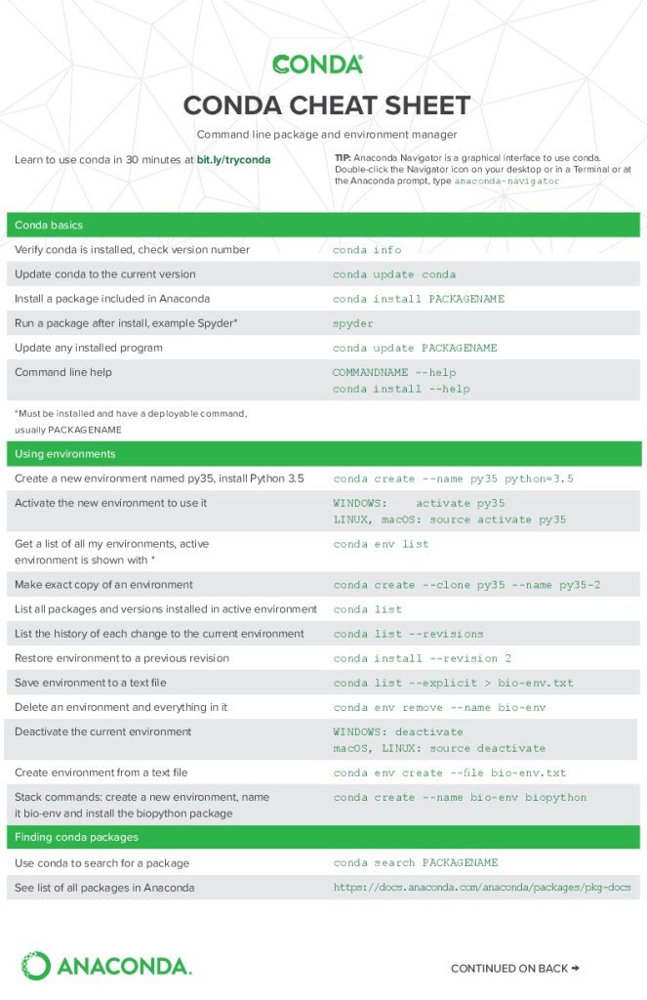
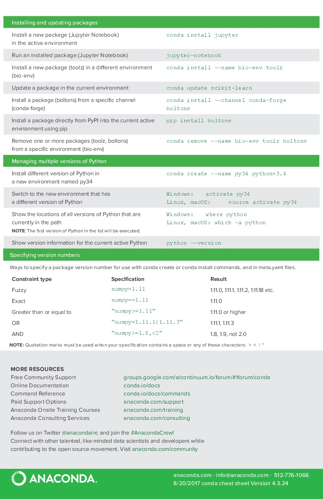

# Conda package manager

## Installing Miniconda package manager

* You can follow the below direction for mac and linux (windows with bash shell installed) users

        *** Install Miniconda3 for 64-bit Linux And Windows users using bash shell ***
        curl https://repo.anaconda.com/miniconda/Miniconda3-latest-Linux-x86_64.sh -O
        bash Miniconda3-latest-Linux-x86_64.sh
        rm Miniconda3-latest-Linux-x86_64.sh

        *** Install Miniconda3 for 64-bit macOS ***
        curl https://repo.anaconda.com/miniconda/Miniconda3-latest-MacOSX-x86_64.sh -O
        bash Miniconda3-latest-MacOSX-x86_64.sh
        rm Miniconda3-latest-MacOSX-x86_64.sh


* The installer will ask you questions during the installation:
    - do you accept the license terms? (Yes)
    - do you accept the installation path or do you want to chose a different one? (Probably yes)
    - do you want to run conda init to setup conda on your system? (Yes)


* Either restart your shell so the settings in ```~/.bashrc/~/.bash_profile
    ``` can take effect, or ```source ~/.bashrc/~/.bash_profile```.

* Or for users (mac, linux and windows (PwoerShell)) Please follow the direction [here](https://docs.conda.io/projects/conda/en/latest/user-guide/install/index.html)

* Once you have miniconda installed, check the version.

        conda --version # which version you are running.
        which conda # Location on your computer.

# Why Conda

Briefly, Anaconda, or conda, is a software package manager. Anaconda will make your scientific programming life easier by facilitating software installations for many programs or packages. You can google `conda install for software X`, and often find a single line command to install the most recent version of that software.

Even better, Anaconda allows you to create compartmentalized computational environments (called conda environments) where you can install any mixture of things you require without accidentally messing up other software downloads on your computer. You can use these conda environments in any number of ways– they can be program-specific (for the running of one specific tool) or project-specific (to store versions for a whole workflow). For instance, you may working on a collaborative project which requires building bioinformatic pipelines with several different programs. It is key that your collaborator and you maintain the same versions of software, so code that you write individually can be easily shared. For this, you can create and share a conda environment. More info on getting started with conda [here](https://docs.conda.io/projects/conda/en/latest/user-guide/getting-started.html).

Conda environments have been widely adopted as a means of facilitating reproducible computation across the Python ecosystem– but is now expanding to include other programming languages such as R more [here](https://docs.anaconda.com/anaconda/user-guide/tasks/using-r-language/).


# Creating a Conda environment for R


* To use R in an environment, all you need to do is install the r-base package. This will install the latest R version.
We can create R environment with the following command:

        conda create -n r-env r-base=3.6.1
        type R to check the R version. (it should be 3.6.1 (2019-07-05))
        Quit R quit() or q().

* if you want you can create a new conda environment with all the r-essentials conda packages built from CRAN: (Do not do it now for time sake)

        conda create -n r_env r-essentials r-base

* Activate the environment:

        conda activate r_env

* to install a specific package:

        conda install -c r package-name.

!!!Note    
    The flag -n is for environment name, the flag -c is for channel name.


* Conda’s R packages are available from the R channel of Anaconda Cloud, which is included by default in Conda’s default_channels list, so you don’t need to specify the R channel when installing R packages like, say, tidyverse.

         conda activate r-env
        (r-env)  conda install r-tidyverse=1.2.1          

* List the packages in the environment:

        conda list

!!! Tip
    You can also search for any R package if you know the name, such as ``` conda search -f r-EXACTNAME```. Replace EXACTNAME with the desired CRAN or MRAN R package name. For example, for rbokeh, you would use ``` conda search -f r-rbokeh```.
    Also, Find out what versions of r-factominer are available in the bioconda channel using ```conda search -c conda-forge r-factominer``` you can seek more details by using conda search --help.


* remove a package form the environment

        conda remove r-tidyverse

!!!NOTE
    For more details on managing packages see [here](https://docs.conda.io/projects/conda/en/latest/user-guide/tasks/manage-pkgs.html)

* if you want to install an older version of R you can search within conda for all older versions (Do not do it now for time sake)
    - ```conda search r-base``` or ```conda search -c r r```
    - create environment ```conda create -n r_env```
    - install the the package with conda ```conda install -c conda-forge r=3.4.1```.

* To see all your environments you can run:

        conda info --envs


* To remove environment

        conda env remove -n env_name

* Some package groups require installation through a different conda channel. Two of the main ones I use are bioconductor Bioconda and conda-forge. Next, we will setup the the default channels (from where packages will be searched for and downloaded if no channel is specified).

        Type these commands in this exact order:
        conda config --add channels defaults
        conda config --add channels bioconda
        conda config --add channels conda-forge

!!! NOTE
    to remove a channel type

        conda config --remove channels `channel-name`
        
!!! NOTE
    If you already have Miniconda or Anaconda installed, and you just want to upgrade, you should not use the installer. Just use `conda update`.

# Opening RStudio within the R conda environment

* To run RStudio in our environment, we can use the single-line conda command(this will install the latest version of RStudio)

        conda install -c r rstudio

* Launch RStudio by typing rstudio. The first line in the RStudio console should be the same as when we launched R from the command line directly R version 3.6.1 (2019-07-05). To close RStudio, you can close RStudio itself, or CTRL+C in the terminal from where you launched it.

* Deactivate the current environment by running

        conda deactivate

!!! note
    You can now remove the environments you created.


* After making a few different environments and installing a bunch of packages, Conda can take up some disk space. You can remove unnecessary files with the command:

        conda clean -a


# How to make your project reproducible with Conda environment

We have up until now specified which Conda packages to install directly on the command line using the ```conda create``` and ```conda install``` commands. For working in projects this is not the recommended way. Instead, for increased control and reproducibility, it is better to use a file (in yaml format) specifying packages, versions, and channels needed to create the environment for a project.


* Creat a new environment and installing packages:

        conda create -n r_env r-essentials r-base
        conda activate r_env
        conda install -c r rstudio
        conda install -c conda-forge r-factoextra


* initiate a git repository and git clone our project using the following command

        git clone https://github.com/ranibasna/Reproducible-research-with-R-.git
        # if  you are using an ssh client then clone using ssh

* Go a head and run the following command within your current directory

        Rscript clustering_code/cluster_code.R CsvData/USArrests.csv Results/clustering_result.csv

* You can see that, now inside the results folder, we have a CSV file that contains the data with the resulting clusters.

* Suppose that some one else need to run the `cluster_code.r` file which is already written in the file clustering_code (Another researcher who want to reproduce your result or one of the journal referees). But in order for us to assure reproducibility of the environment, we will build a file that assures such an approach. The easiest way to make your work reproducible by others is to include a file in your project’s root directory listing all the packages, along with their version numbers, that are installed in your project’s environment. Conda calls these environment files.

* You can make the ```environment.yml``` file in the following way:

        (conda-env) % conda env export --file environment.yml       # Or -f

* Go ahead and check the environment.yml file to see the structure.


* You can also make this environment file manually by adding the necessary packages one by one. So for example we make the ```environment.yml``` file in the following way:

        channels:
            - conda-forge
            - bioconda
        dependencies:
            - r-base=3.6.1
            - r-essentials=3.6
            - r-factominer=1.42
            - r-factoextra=1.0.5

* Once you created the environment file, anyone can make a new Conda environment from the yaml file which is identical to the one we have reproducing our environment. (note that here the command is conda env create as opposed to conda create that we used above):

        conda env create -n r_env2 -f environment.yml


!!! Tip
    * Restoring environment to a previous revision: Conda keeps a history of all the changes made to your environment, so you can easily "roll back" to a previous version. (this is very import in case you make some error by installing a wrong package or mess up with something instead of removing the environment and state from the beginning).

    * To list the history of each change to the current environment:

            conda list --revisions

    * To restore environment to a previous revision:

            conda install --rev REVNUM

    * NOTE: Replace REVNUM with the revision number.    


## Conda cheat sheet




